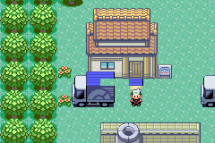
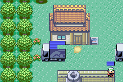

# vibe-gba

`vibe-gba` is a scratch-built Rust Game Boy Advance emulator prototype. It was developed with one concrete milestone in mind: boot a legally supplied `Pokemon Emerald.gba` ROM far enough to render the game, pass the new-game onboarding route, walk through Littleroot Town into Route 101, reach Professor Birch's starter bag, and receive the first Pokemon in Birch's lab.

This repository does not include any ROM, save file, emulator state snapshot, or existing GBA emulator engine. The implementation is intentionally small and direct: ARM7TDMI execution, memory bus, cartridge loading, save memory, DMA/timers/interrupts, PPU background and OBJ rendering, keyboard input, screenshots, save states, and a handful of Emerald-specific high-level assists for the current milestone path.




## Status

Current milestone:

- Boots Pokemon Emerald from a user-provided `.gba` or zipped `.gba` file.
- Renders title/menu/intro/truck/Littleroot/Route 101/Birch Lab scenes.
- Supports deterministic headless runs with scripted input, screenshots, state save/load, and debug dumps.
- Supports interactive keyboard play once the window is opened.
- Can enter Littleroot Town from the truck, move the visible player sprite with directional facing and walk animation, enter Route 101, interact with Birch's starter bag, and arrive in Birch's lab with Treecko in the party.

This is not a general-purpose, compatibility-focused GBA emulator yet. Many games and many Emerald paths are expected to need more CPU, PPU, audio, BIOS, timing, and hardware coverage.

## Build

Install Rust, then:

```bash
cargo build --release
```

The binary is:

```bash
target/release/vibe-gba
```

## Run From A Fresh ROM

Provide your own legally dumped ROM:

```bash
target/release/vibe-gba "/path/to/Pokemon Emerald.gba" \
  --save /tmp/emerald-fresh.sav
```

Keyboard mapping:

| GBA | Keyboard |
| --- | --- |
| A | `Z` or `A` |
| B | `X` or `S` |
| Start | `Enter` |
| Select | `Backspace` |
| D-pad | Arrow keys |
| L / R | `Q` / `E` |
| Quit | `Esc` |

From the title screen:

1. Press `Enter` or `Z` on the title screen.
2. If the dry battery prompt appears, press `Z` through it until the `NEW GAME` / `OPTION` menu is visible.
3. Choose `NEW GAME` with `Z`.
4. Advance Birch's intro text with `Z`.
5. Pick gender, enter a name, then continue until the moving truck scene.
6. Walk right to exit the truck into Littleroot Town.
7. Walk to the north exit and keep going into Route 101.
8. Walk to the starter bag near Birch and Zigzagoon, press `Z`, release it, then press `Z` again while facing Birch in his lab to finish receiving the starter.

## Deterministic Milestone Check

The fresh-boot menu path can be checked without a save state:

```bash
target/release/vibe-gba "/path/to/Pokemon Emerald.gba" \
  --save /tmp/vibe_fresh_menu.sav \
  --frames 5000 \
  --input-script '3200:20:start,3850:20:a,4400:20:a' \
  --screenshot /tmp/vibe_fresh_menu.png \
  --dump-state
```

The screenshot should show the `NEW GAME` / `OPTION` menu. One more `A` press reaches Birch's gender prompt:

```bash
target/release/vibe-gba "/path/to/Pokemon Emerald.gba" \
  --save /tmp/vibe_fresh_boygirl.sav \
  --frames 5500 \
  --input-script '3200:20:start,3850:20:a,4400:20:a,4800:20:a' \
  --screenshot /tmp/vibe_fresh_boygirl.png \
  --dump-state
```

The local development run used save states to verify the final starter milestone. State files are not committed because they may contain ROM-derived data. If you have generated compatible local states, the starter check from Littleroot looks like this:

```bash
target/release/vibe-gba "/path/to/Pokemon Emerald.gba" \
  --load-state states/littleroot_entry_fix15.bin \
  --frames 820 \
  --input-script '0:54:right,90:125:up,300:32:left,350:8:up,420:40:a,580:40:a' \
  --save-state /tmp/vibe_littleroot_to_starter_lab.bin \
  --screenshot /tmp/vibe_littleroot_to_starter_lab.png \
  --dump-state
```

Expected debug markers:

- `layoutId=003a`
- `callback2=08085e5d`
- `PLAYER_OBJECT` reports `map=1.4`
- `SAVE route101=3 birch_lab=3 starter=0 party_count=1 starter_species=277`
- `SAVE_FLAGS pokemon_get=true rescued_birch=true hide_bag=true hide_zigzagoon=true hide_lab_birch=false`
- The screenshot is Professor Birch's lab with the player and Birch visible.

Movement can still be checked from the same Littleroot state:

```bash
target/release/vibe-gba "/path/to/Pokemon Emerald.gba" \
  --load-state states/littleroot_entry_fix15.bin \
  --frames 700 \
  --input-script 0:32:down,120:64:right \
  --screenshot /tmp/littleroot_walk.png \
  --dump-state
```

The player coordinates, visible OAM position, facing direction, and animation frame should move while staying on `layoutId=000a`.

## CLI

```text
vibe-gba <rom.gba|zip>
  --save file.sav
  --frames N
  --screenshot out.png
  --save-state state.bin
  --load-state state.bin
  --dump-state
  --hold-a
  --hold-start
  --input-script frame:duration:buttons,...
  --stop-pc HEX
  --stop-hit N
  --stop-invalid
  --max-steps N
  --turbo
  --trace
```

Input script example:

```text
0:32:down,120:64:right,260:16:a
```

## Implementation Notes

- `src/cpu.rs`: ARM/Thumb CPU core plus narrow Emerald milestone HLE hooks for early movement, map transitions, and starter acquisition.
- `src/bus.rs`: memory map, IO, DMA, timers, save memory, and state serialization.
- `src/ppu.rs`: framebuffer rendering for bitmap/text/affine backgrounds, OBJ sprites, and blending.
- `src/cartridge.rs`: raw and zipped ROM loading plus flash save behavior.
- `src/gba.rs`: emulator orchestration, frame stepping, save states, and debug summaries.
- `src/main.rs`: CLI, keyboard input, window loop, screenshots, and scripted input.

The original development prompt is preserved in [PROMPT.md](PROMPT.md).

## License

MIT. See [LICENSE](LICENSE).
